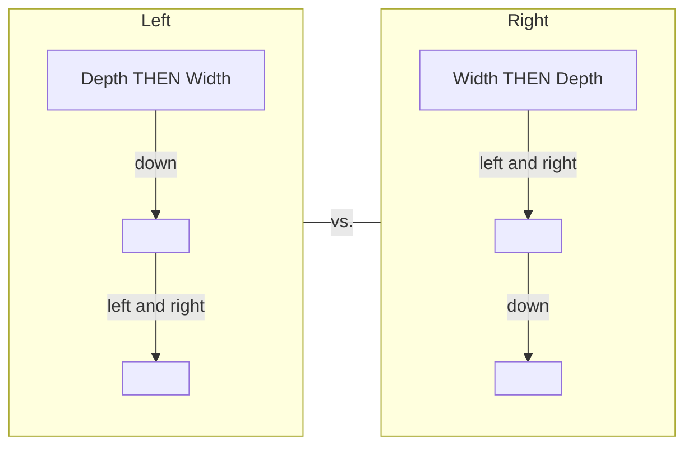

## Mastering the Give : Ask ratio


---


Gary Vaynerchuk popularized “jab, jab, jab, right hook.” It simplifies the idea of giving to your audience many times before making an ask. You deposit goodwill with rewarding content, then withdraw from it by making offers. When you deposit goodwill, your audience pays more attention. When you deposit goodwill, your audience is more likely to do what you ask. So I try to “under-ask” my audience and build as much goodwill as possible.

Thankfully, the give : ask ratio has been well-studied. Television averages 13 minutes of advertising per 60 minutes of air time. That means 47 min are dedicated to ‘giving,’ and 13 min are dedicated to ‘asking’. That’s roughly a 3.5:1 ratio of giving to asking. On Facebook, it’s roughly 4 content posts for every 1 ad on the newsfeed. This gives us an idea of the minimum give : ask ratio we can sustain. After all, television and Facebook are mature platforms. They care less about growing their audiences and care more about making money from them. So they give less and ask more. Which means “give, give, give, ask” is the ratio that gets us closer to *maximally monetizing* an audience without shrinking it. But, most of us want to grow, so we shouldn’t model them. We should model growing platforms.

So what do growing platforms do? They display lots of content without many advertisements at all. In short, they give give give… give give give… give give give… give give give… maybe ask. They dramatically over give and under ask. Why? Because the more you reward your audience, the bigger it gets. So if you want to grow an audience, give far far more than you ask.


---


And now that I have some experience with it, I’ve got a slight tweak on the traditional give-ask strategy that puts it on steroids:  
*Give until they ask.*

----

**[Diagram description]**  
A sequence of stick figures showing the process:  
- First figure gives a free gift labeled "Free" with a tag "To You From Me" to the second figure.  
- This giving repeats multiple times (indicated by "Again and Again").  
- Finally, the second figure asks, "You're great! Can I pay you?"  
- The first figure responds, "Yes, I accept money," handing over a dollar bill.

----

People are always waiting for you to ask for money. And when you don’t, they trust you more. They share your stuff more. You grow faster, etc. But I’m not some altruistic saint. I’m here to make money. After all, I wouldn’t be a good businessman if I weren’t making any.

So, it’s simple. If you give enough, *people start asking you*. It makes people uncomfortable to continue to receive without giving back. It is core to our culture and DNA. They’ll go to your website, DM you, email you, etc., to ask for more. Not only that, when you use this strategy, you get the *best* customers. They are the ones who are the biggest ‘givers.’ They are the ones who, even as paying customers, still feel they get the better end of the deal. And best of all, if you advertise this way, *your growth never slows*. When you use this strategy, you *give in public, ask in private*. You let the audience self-select when they’re ready to give you money. That’s why, in my opinion, *give until they ask* is the best strategy. But, if you feel like asking, I get it. So, let’s talk about how to ask. If you’re gonna do it, you might as well do it well.


---


**Bottom Line:** The moment you start asking for money is the moment you decide to slow down your growth. So the more patient you are, the more you will get when you finally make your ask.

**Action Step:** Give give give give give give *until they ask*

> **Pro Tip: Give in public, ask in private.**  
> If you continue to give in public, people will ask you privately to sell them stuff. Bank on it. The best of both worlds is to never stop giving in public and get an increasing number of people asking you privately to buy your stuff. Give give give, and you will get - without losing goodwill or slowing your audience growth.

### How To Make Money From Content: Ask

[Drawing of a video player with a smiley face] → [Drawing of a stick figure holding two money bags]

To be clear, I think you should use the *give until they ask* strategy.  
But, if you need to pay rent, feed your family, etc., I get it.  
Sometimes you gotta ask. So let’s talk about how to do that without sounding like a nincompoop.


---


Think of ‘asks’ as commercials. You *interrupt this program with a very important message.* Since you are the one providing the value, you interrupt your own content with commercials about the stuff you sell. But, since it’s your audience, you pay the cost of potential loss of trust, slowing growth, and of course, the time it took you to gather the audience in the first place. But money-wise, it’s free. Now, I use two strategies to weave promotions into content: integrated offers and intermittent offers. Let’s cover both.

----

**INTEGRATED**  
*Single Piece of Content*

```
[heart] ! ?   [heart] ! ?   [heart] ! ?   [OFFER]   [heart] ! ?   [heart] ! ?   [heart] ! ?
```

----

**Integrated**: You can advertise in every piece of content so long as you keep your give : ask ratio high. You will continue to grow your warm audience *and* get engaged leads. Win-win.

For example, if I make an hour-long podcast, having 3 x 30-second ads means I’d have 58.5 min of giving to 1.5 min of asking. Well above the 3:1 ratio.

On the flip side, I had a friend who had a podcast that blew up quickly. Eager to monetize his new audience, he started making offers (asking) too frequently *-in-* the content. His podcast not only stopped growing, it actually shrank! Don’t be like that. Don’t kill your golden goose. It’s a balancing act. Over-give to protect your most valuable asset - the goodwill of your audience.


---


**Action step:** I most commonly integrate the ‘asks’ - aka - CTAs after a valuable moment or the end of the content piece. Consider trying one of those places first - and make sure your audience growth doesn’t slow. Then add in the second and so forth.

> **Pro Tip: PS Statement Asks**  
> The “PS” statement is one of the most read parts of any content. Often, because it summarizes the main thing the author wants the audience to do. So, I try to include them in everything I write. It’s also one of my favorite places to put make asks.  
>  
> PS - see, everyone reads these.

```
INTERMITTENT
MANY PIECES OF CONTENT
#1  #2  #3  #4  #5     #6  #7  #8
♥    ♥    ♥    ♥    ♥       ♥    ♥    ♥
! ?  ! ?  ! ?  ! ?  ! ?      ! ?  ! ?  ! ?
                 O F F E R
```

**Intermittent:** The second way you can monetize is through intermittent asks. Here’s how it works. You make many pieces of content of pure ‘gives’ then occasionally make an ‘ask’ piece. Example: You make 10 ‘give’ posts, and on the 11th, you promote your stuff.


---


The difference between the first way and the second way depends on the platform. On short platforms, the intermittent way will dominate. On long-form platforms, integrations are often your best bet.

When you make your ask, you either advertise *your core offer*, or *you advertise your lead magnet*. That’s it. Don’t overcomplicate this.

**Lead Magnet Example:** If I just talked about a way to get more leads on a post/video/podcast/etc., I would then say, “I have 11 more tips that have helped me do this. Go to my site to grab a pretty visual of them.” And as long as I have an audience that wants to get more leads, this will get some of them to engage. Then, the thank you page after the opt-in page for my lead magnet would display my paid offer with some video explaining how it works. Bonus points if your lead magnet is relevant to your content advertising it.

**Offer Example:** You can also ‘go for the jugular’ with your core offer and go straight for the sale. The direct path to money. We model our offer from the last chapter.

*“I’m looking for 5 (specific avatar) to help achieve (dream outcome) in (time delay). The best part is, you don’t have to (effort and sacrifice). And if you don’t get (dream outcome), I will do two things (increase perceived likelihood of achievement): 1) I will hand you your money back 2) I will work with you until you do. I do this because I want everyone to have an amazing experience with us and because I’m confident I can deliver on my promise. If that sounds fair, DM me/book a call/comment below/reply to this email/ etc.”*

After you make your ask, get back to providing value.


---


> **Pro Tip: $100M Offers**  
>  
> My first book, $100M Offers, breaks down the offer creation process step by step. If you want to know how to create a valuable offer that the *right* person would feel stupid saying no to... go check out that book (the kindle version is sold as cheap as the platform will allow me to sell it, if you’re strapped for cash). If it helps you feel more comfortable, more than 10,000 people left it a 5-star review in the first fifteen months since it was published. And it has sat atop the #1 best seller in marketing, advertising, sales lists for 100+ weeks and counting. If you don’t know what to sell, read that book to get it right the first time.

*^This box is an example of an integration.*

**Action Step One:** Pick whether you integrate it or make an intermittent ask. Then, pick whether you’ll advertise your core offer or lead magnet. If you’re not sure, do the lead magnet. It’s lower risk.

**How to Scale It**




---


After you start asking, you’re gonna start getting leads and making money. But you don't want to stop there, do you? Didn’t think so. Cool, so let’s talk about scale.

There are two opposing strategies to scale your warm audience. They both follow progressive steps. First, you have the depth-then-width approach. Then, you have the width-then-depth approach. Both are right. Here’s how they work:

**Depth then width:** Maximize a platform, then move onto the next platform.

**Step #1:** Post content on a relevant platform.

**Step #2:** Post content regularly on that platform.

**Step #3:** Maximize quality and quantity of the content on that platform. Short form, you may sometimes be able to get up to ten times per day per platform. Long form, you may have to get up to five days per week (see soap operas).

**Step #4:** Add another platform while maintaining the quality and quantity on the first platform.

**Step #5:** Repeat steps 1-4 until all relevant platforms are maximized.

**Advantages:** Once you figure out one platform, you maximize your return on that effort. Audiences compound faster the more you do. You take advantage of this compounding. Fewer resources are required to make this work.


---


**Disadvantages:** You have less low hanging fruit of new platforms and new audiences. You don’t accomplish the feeling of ‘omnipresence.’ In the beginning, you risk your business being reliant on a single channel. This is a risk because platforms change all the time and sometimes ban you for no reason. If you only have one way to get customers, it can kill your business if it gets shut down.

**__Width then depth:__** Get on every platform early, then maximize them together.

__Step #1:__ Post content on a relevant platform.

__Step #2:__ Post content regularly on that platform.

__Step #3:__ *Here’s where this strategy differs from the one before.*  
Instead of maximizing your first platform. Move onto the next relevant platform while maintaining the previous.

__Step #4:__ Continue until you are on all relevant platforms.

__Step #5:__ Now, maximize your content creation on all platforms at once.

**Advantages:** You reach a broader audience faster. And, you can “repurpose” your content. So with a little extra work, you can capture tons of efficiency. With minimal changes to the format, you can make the same content fit multiple platforms. For example, it takes little extra effort to format a single short video across all platforms distributing short video content.


---


**Disadvantages:** It costs more labor, attention, and time, to do this well. Oftentimes, people end up with lots of bad content everywhere. Sucky fluff. No bueno.

If you already have a sizable business, scale up faster and reap the rewards of an asset that only gets better with time. I said it before and I’ll say it again. The best day to start posting content was the day you were born. The second best day is today. Don’t wait like I did.

----

### Pro Tip: How I Get It Done

**I am not a full time content creator.** I run businesses. But, content creation is a part of my responsibility. Here’s my simple process for recording.

1) I find topics using the five ways from the “topics” section in Part I of this chapter. This takes me about an hour.

2) I sit down twice every month and record thirty or so short clips based on Step 1.

3) On the same day, I record 2-4 longer videos unpacking tweets that had more stories or relevant examples. This creates my longer form content.

If this sounds simplistic, it’s because it is. Just start. You can add volume over time.


---


**Action Step:** Pick an approach. Start posting. Then, go up the scaling steps over time.

> **Pro Tip: Only One Call-To-Action At A Time**  
> *‘A confused mind doesn’t buy’* is a common saying in the sales and marketing world. To increase how many people do what you want, only ask them to do one thing per call to action. For example, don’t ask people to “share, like subscribe, and comment” at the same time. Because instead of doing them all, they’ll do none. Instead, if you want them to share, *only* ask them to share. And if you want them to buy, *only* ask them to buy. Make up your mind, so they don’t have to.

### Why You Should Make Content (even if it’s not your primary advertising strategy)

January 2020.

I called all the major departments to a meeting to answer an important question: *Why isn’t our paid advertising working like it used to?* Opinions flooded the room. “The creative…the copy…the offer…our pages…our sales process…our price…” They shot back and forth at each other, every bit as invested as I was in solving the problem.

Leila and I sat quietly as the team debated. After the din died down, Leila, in her wise fashion, asked a different question: *What did we* ~~stop~~ *doing in the months before the decline?*


---


A new debate arose and a unanimous answer surfaced: Alex stopped making gym content and started talking about general business. Now, I didn’t know how important that was, but I had to find out. So, I sent a survey to our gym owners. I asked if they had consumed any content of mine *before* they booked a call. The results astounded me.

* _78% of all clients had consumed at least TWO long form pieces of content, prior to booking a call._

I had fallen into my old ways and given paid ads all the credit. But, our free content was nurturing the demand. Don’t make the same mistake I did. Your free content gives strangers an opportunity to find, get value from, and share your stuff. And, it warms people on the fence that go to and come from the cold audience methods we dive into next. So even if it’s hard to measure, free content gets you better returns on all advertising methods.

**Bottom line:** Start making content relevant to your audience. It will make you more money.

### 7 Lessons I’ve Learned From Making Content

1) **Switch from “How to” to “How I.” From “This is the best way” to “These are my favorite ways” etc.** (especially when starting out). Talk about what you’ve done, not what others should do. What you like, not this is *the* best. When you talk about experience, no one can question you. This makes you bulletproof.

   a) I make my oatmeal this way vs. you should make your oatmeal this way.


---


b) How I Built My 7-Figure Agency vs. How To Build a 7-Figure Agency.

c) My favorite way to generate leads for my business vs. This is the best way to generate leads for your business.

It’s subtle. But when you tell your experience, you are sharing value. When you tell a stranger what to do, it's hard to avoid coming off preachy or arrogant. This helps avoid it.

2) **We Need To Be Reminded More Than We Need To Be Taught:**  
You’re a silly goose if you think 100 percent of your audience listens 100 percent of the time. For example, I post about my book every single day. I surveyed my audience and asked them if they knew I had a book. One in five that saw the post said they didn’t know. Keep repeating yourself. You’ll get bored of your content before your whole audience even sees it.

3) **Puddles, Ponds, Lakes, Oceans.** Narrow the focus of your content. If you have a small local business, you probably shouldn’t make general business content. Not at first, at least. Why? The audience will listen to people with better track records than you. But you can narrow your topics to what you do and the place you do it.  
Example: plumbing in a certain town. If you do that, you can become king of that puddle. Over time, you can expand your plumbing puddle to the general local business pond. Then the lake of brick & mortar chains and so forth. Then eventually, the ocean of general business.

4) **Content Creates Tools For Salespeople.** Some content will perform well and get more people interested in buying your stuff. That content *helps your sales team*. Create a master list of your “greatest hits.” Label each ‘hit’ with the problem it solves and the benefit it provides. Then, your sales team can send it before or after sales calls and help people decide to buy. They work especially well if the content resolves specific concerns prospects commonly


---


5) **Free Content Retains Paying Customers.** How a customer gets value from you matters less than where they got it. Imagine a person pays for your thing and then consumes your free content. If your free content is valuable, they will like you more and stay loyal to your business longer. On the flip side, if they consume your free content, and it sucks, they will like your paid product less. Here’s something you may not know. Somebody who buys your stuff is *more likely* to consume your free content. This is why it’s so important to make your free content good - your customers will include it in how they calculate their ROI from your paid thing.

6) **People don't have shorter attention spans, they have higher standards.** Repeated for emphasis: *there’s no such thing as too long, only too boring.* Streaming platforms have proven that people will spend hours binging long form content *if they like it.* Our biology hasn't changed, our circumstances have. They have more rewarding stuff to choose from. So make good stuff people like and reap the rewards rather than whining about people’s “short attention spans.”

7) **Avoid Pre-Scheduling Posts.** The posts I manually post perform better than ones I pre-schedule. Here’s my theory. When you manually post, you know that within seconds you will be rewarded or punished for the quality of the content. Because of that close feedback loop, you try *that much harder* to make it better. When I schedule stuff out, I don’t feel that same pressure. So whenever I post, or my team does, we strongly believe in someone pressing the ‘submit’ button because it gives that last bit of pressure to get it right. Try it.

**Benchmarks - How Well Am I Doing?**


---


If our audience grows, we did good. But if our audience grows fast, we did *gooder*. So I like to measure my audience size and speed of growth monthly.

Here’s what I measure:

1) Total followers and reach - *How big*

   a) Follower Example: If I go from 1000 followers across all platforms to 1500, I grew my audience by 500.

   b) Reach Example: If I go from 10,000 people seeing my stuff to 15,000 people seeing my stuff, I grew my *reach* by 5,000 people.

2) Rate of getting followers and reach - *How fast*

   You compare the growth between months:

   a) Example: If I gained those 500 followers in a month, that would make it a 50% growth month. (500 New / 1000 Started = 50% growth rate).

   b) Example: If I reached those 5000 extra people in a month, that would make it a 50% growth month. (5000 New / 10,000 Started = 50% growth rate)

Remember, we can only control inputs. Measuring outputs is only useful if we are consistent with inputs. So, pick the posting cadence you want to stick with on a particular platform. Then pick your ‘ask’ cadence on that platform (how you will direct people to become engaged leads). Then, start, and…Do. Not. Stop.


---


> Alex Hormozi  
> @AlexHormozi  
>  
> It’s amazing what you can accomplish if you don’t stop once you start.

For reference, I posted a new podcast twice a week for four years before even getting picked up on the Top 100 list. Because I did the same thing every week for years, I knew I could trust the feedback. In the beginning, it didn't grow much. It took time for me to get better. And I knew I had to make more, over a long time, for that to happen.

So if your listeners go from ten to fifteen in a month, that’s progress baby! Even with small absolute numbers, that’s fifty percent monthly growth! It’s why I like to measure both the absolute and relative growth and pick the one that makes me feel better (ha!). As my friend Dr. Kashey says, “The more ways you measure, the more ways you can win.” Be consistent. Measure a lot. Adapt to feedback. Be a winner.

To close the loop, in its **fifth year**, my podcast- *The Game*, became a Top 10 podcast in the US for business and top 500 in the world. This was only possible *after 5 years* of *multiple podcasts per week every week*. Remember, everyone starts at zero. **You just gotta give time, time**.

**Your First Post**


---


You’ve probably been providing value to other humans knowingly or unknowingly for a while. So the first post you make, *you can make an ask*. My hope is that it gets you your first engaged lead. If it doesn’t, you need to give for a while, then make an ask once you’ve earned the right to. To show you that I’m not making this up, below you can find my first business post ever. Is it ideal? No. I had no idea what I was doing. Should you copy it, probably not. Main point: don’t be afraid of what other people think. If someone won’t speak at your funeral, you shouldn’t care about their opinion while you’re alive. Honor the few who believe in you by having courage.

> Alex Hormozi  
> April 9, 2013 · Baltimore, MD ·  
> Everyone,  
> For those of you who know me, you know two things:  
> 1) I am terrible with all things technological. For example, I just heard about spotify a few weeks ago, seriously.  
> 2) I love training/nutrition and "fitness" more than, well, a whole lot.  
> So, today is sort of special because it marks a day when my love of training vanquished my fear of technology.  
> What do I mean?  
> For the better part of a year I have been taking part in a free personal training project with the idea that I would give away free personal training to anyone who was willing to give some of their $500-$1000 to a cause of their choice. This way, they wouldn’t have to be motivated by the same thing as me, but be motivated to give to their cause and benefit themselves. When I first introduced the idea, I was happily surprised with the amount of positive support I received.  
> So, almost a year from my first client, I NOW HAVE A WEBSITE!! to formally show some of the transformations that have gone underway using my programming and as a formal means of contacting me about signing up.  
> I CURRENTLY HAVE A FEW SLOTS OPEN IN MY ROSTER, SO DROP ME A NOTE QUICKLY IF YOU ARE INTERESTED! THANKS SO MUCH!  
> Take a second to check out some of the ridiculous transformations in record. time. CHECK IT OUT

Whenever I read this, I just think “you goon.” But hey, I was trying. And for that, I’m proud.

**Recap**

We covered eight things:


---


1) The Content Unit - done

2) Short vs. Long Form Content – done

3) Mastering the Give:Ask Ratio – done

4) How to Ask – done

5) How to Scale It – done

6) Lessons From Content – done

7) Benchmarks – done

8) Your First Post – done

Now, you know. Nothing’s stopping you.

**So What Do I Do Right Now?**

Posting free content is less predictable than, but complementary to, warm reach outs. So *keep doing warm reach outs*. Also, posting free content grows your warm audience. And a bigger warm audience means more people for warm reach outs. So free content gets engaged leads on its own and *keeps getting* engaged leads through warm reach outs. Instead of ditching one for the other, I recommend you post free content *in addition to* warm reach outs.

Let’s fill out our daily action commitment for our first platform.


---


<table>
<thead>
<tr>
<th colspan="2">Post Content Daily Checklist</th>
</tr>
</thead>
<tbody>
<tr>
<td><strong>Who:</strong></td>
<td>Yourself</td>
</tr>
<tr>
<td><strong>What:</strong></td>
<td>Value: Give give give until they ask</td>
</tr>
<tr>
<td><strong>Where:</strong></td>
<td>Any media platform</td>
</tr>
<tr>
<td><strong>To Whom:</strong></td>
<td>People who already follow you</td>
</tr>
<tr>
<td><strong>When:</strong></td>
<td>Every morning, 7 days a week</td>
</tr>
<tr>
<td><strong>Why:</strong></td>
<td>Build goodwill. Get engaged leads.</td>
</tr>
<tr>
<td><strong>How:</strong></td>
<td>Written, image, videos, audio posts</td>
</tr>
<tr>
<td><strong>How Much:</strong></td>
<td>100 min per day</td>
</tr>
<tr>
<td><strong>How Many:</strong></td>
<td>As many times as the platform shows it</td>
</tr>
<tr>
<td><strong>How Long:</strong></td>
<td>As long as it takes.</td>
</tr>
</tbody>
</table>

